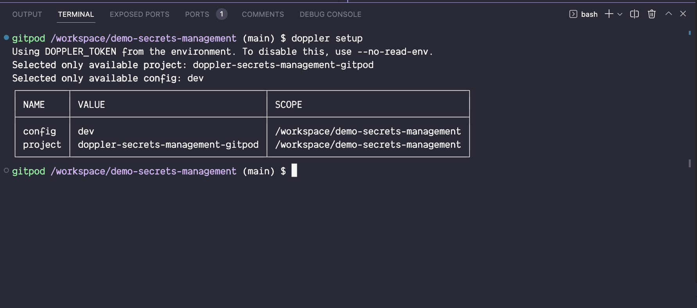
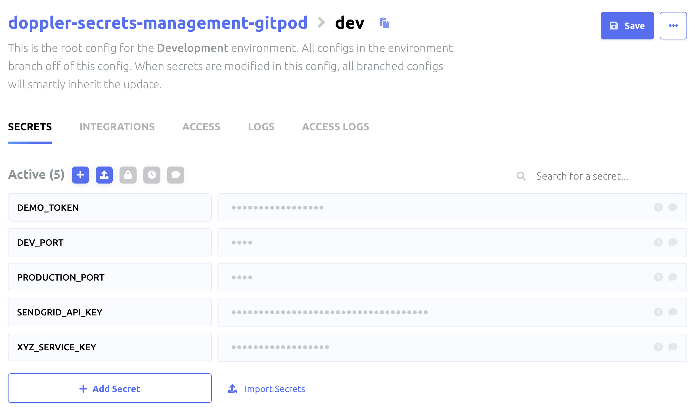
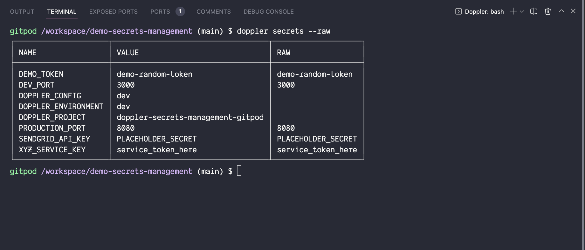
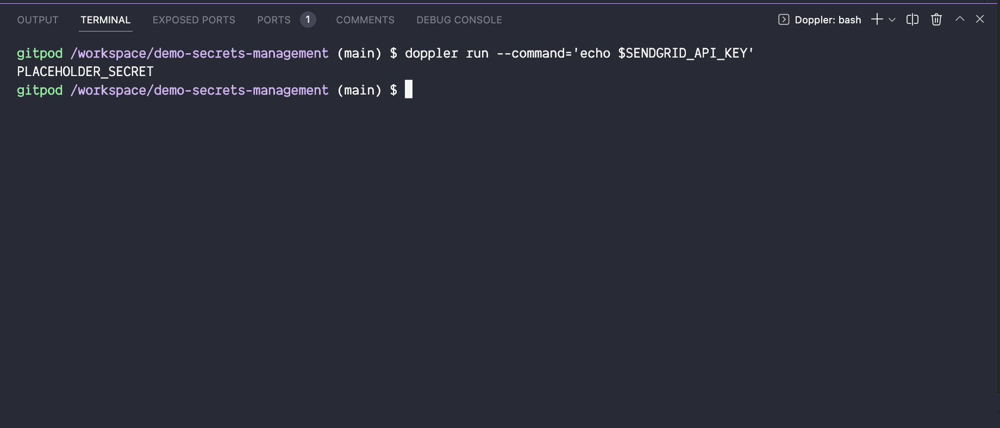

# Secrets management using Doppler on Gitpod

Automate your [Doppler](https://www.doppler.com/) secrets & use them in your developer workflow on a Cloud Dev Environment - Gitpod

## Setting it up

### Doppler Service Token

1. Create a Doppler account and a project.
2. Create a [Doppler service token](https://docs.doppler.com/docs/service-tokens#dashboard-create-service-token) and add it to [Gitpod Environment variables](https://gitpod.io/variables).
3. Start a Gitpod workspace:

   [](https://gitpod.io/#https://github.com/gitpod-samples/demo-secrets-management)

### Doppler CLI

Gitpod is an ephemeral environment, so we need to install the Doppler CLI on every workspace start, but we can do it more smartly with Gitpod [init tasks](https://www.gitpod.io/docs/config-start-tasks/#init-tasks) & [Gitpod Dockerfile](https://www.gitpod.io/docs/configure/workspaces/workspace-image#use-a-custom-dockerfile).

#### Example of a [`.gitpod.Dockerfile`](./.gitpod.Dockerfile) file

```dockerfile
FROM gitpod/workspace-full:latest

# Install & configure Doppler CLI
RUN (curl -Ls --tlsv1.2 --proto "=https" --retry 3 https://cli.doppler.com/install.sh || wget -t 3 -qO- https://cli.doppler.com/install.sh) | sudo sh
```

#### Example of a [`.gitpod.yml`](./.gitpod.yml) file

```yml
image:
  file: .gitpod.Dockerfile

tasks:
  - name: Doppler
    command: |
      doppler setup
```

> **Note**: To speed up Gitpod workspace startup times, you can [configure Gitpod prebuilds](https://www.gitpod.io/docs/configure/projects/prebuilds/#projects-and-prebuilds) to build the Docker image before the first workspace start.

## Add Secrets to Doppler

### Doppler setup

```bash
doppler setup
```

<br/>



### Add Doppler secrets to your project

<br/>



## Use Doppler secrets in your Gitpod workspace

### Print all Doppler secrets

```bash
doppler secrets --raw
```



### Print a specific Doppler secret

```bash
doppler run --command='echo $SENDGRID_API_KEY'
```



## Recommended Doppler Resources

- [Doppler CLI](https://docs.doppler.com/docs/cli)
- [Doppler Service Tokens](https://docs.doppler.com/docs/service-tokens)
- [Doppler Secrets](https://docs.doppler.com/docs/secrets)
- [Doppler Projects](https://docs.doppler.com/docs/projects)

## Recommended Gitpod Resources

- [Gitpod workspaces tasks](https://www.gitpod.io/docs/configure/workspaces/tasks#tasks)
- [Environment variables](https://www.gitpod.io/docs/environment-variables#using-the-account-settings)
- [Custom Docker Image](https://www.gitpod.io/docs/config-docker)
- [Config `.gitpod.yml`](https://www.gitpod.io/docs/config-gitpod-file)
